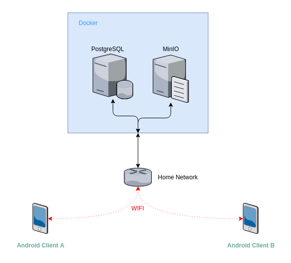

# Debt-Ninja 
## Split/share your receipts with your roommates

## Features
### Add your receipts
 - Add receipt
 - Upload image of receipt
 - Receipt import by QR Code
### Get your monthly result
- Get total cost of all spendings
- Get your difference
### Supports
  - 2+ persons in financial calculation
  - No public server required

## Roadmap
- **Version 0.1** 
  - Add receipt function 
    1) Create receipt (no image)
    2) Save local
    3) Sync with server
  - Financial Status Calculation 
    1) Total spending for a month
    2) Personal difference ("My current debt")
- **Version 0.2** 
  - App Updater (Get Releases directly from Github)
  - Image upload
- **Version 0.3** 
  - Receipt import by QR Code on receipt

## Setup Guide
- Client
  - Download the `.apk` from [Github Releases](https://github.com/Kornek/debt-ninja/releases) on your Android device
  - Allow the installation from external resources
  - Install the application
- [Server](./server/README.md)

## System architecture
