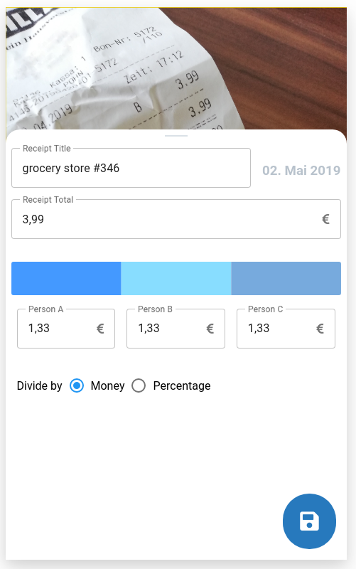

# Mockups

## Add receipt fragment

If there exists a image of the receipt it will be shown at the background.
The form is in a bottom sheet you can drag down to show the full receipt.

**The form contains:**
- receipt title
- date (creationdate - not editable)
- receipt total
    - receipt debt: 
        - e.g. the receipt is 50€ and only 40€ have to be payed by all members
        - _This is a optional field - So only visible on toggle!_
- distribution
    - default is a info that the debt will be devided by all members (debt/members)
    - custom distribution (shown in the picture)
        - custom distribution by money or percentage
- save fab/button on creation
